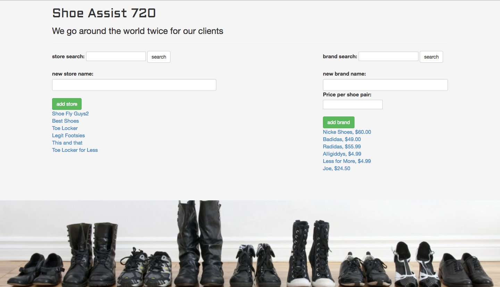
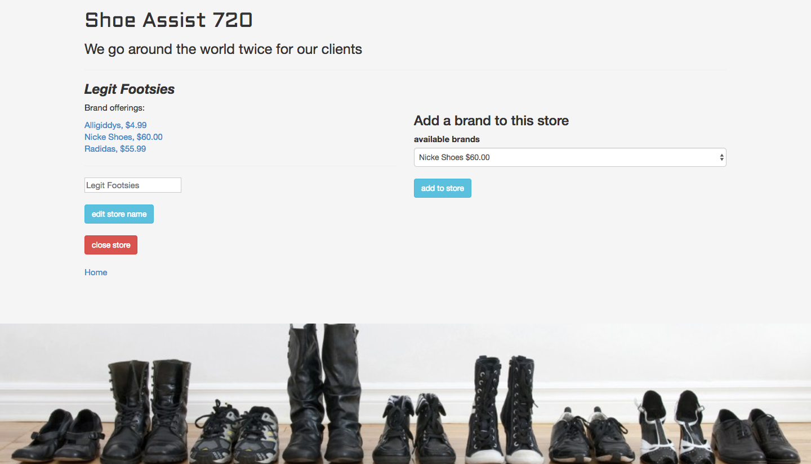
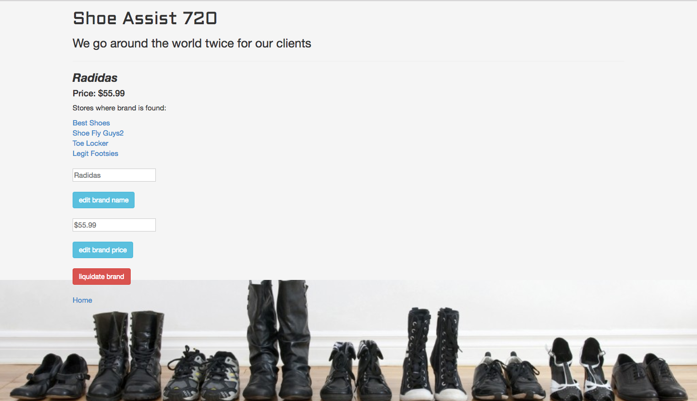

# _Shoe Assist 720_

This website allows the user to create and organize shoe stores and shoe brands with a many to many relationship. Add a brand and name your price. Custom callbacks and validations will ensure undesirable inputs are either discouraged or formatted to be more aesthetically pleasing. You have full control over your own shoe empire as your can update, add and delete at any point. This leverage truly allows the user to accomplish their goal of circling the globe twice for their clients. Shoe Assist 720.

-Schema built with SQL Designer

### Prerequisites

Web browser with ES6 compatibility
Examples: Chrome, Safari

Ruby 2.3.1
Bundler

### Installing

Clone this repo by typing into the terminal:
```
$ git clone https://github.com/gravytates/shoe_assist.git
```

In a new terminal window, start postgres in the background:
```
$ postgres
```

Navigate to this project directory in the terminal. Then type:
```
$ rake db:schema:load
```

In a new terminal tab, start the sinatra server by typing:
```
$ruby app.rb
```
Sinatra will now make this project available in your browser by going to localhost:4567.

## Specifications

| behavior |  input   |  output  |
|----------|:--------:|:--------:|
|add new store with callback styling for name| store name: "legit footsies"|new store: Legit Footsies|
|add new brand with callback styling for name and price| brand name: "nijke", price per shoe pair: 60| Brand: "Nijke", price: $60.00|
|add brand to store| add "Nijke" in Legit Footsies site | Brands offered by Legit Footsies: Nijke |
|validate to prevent duplicates | enter 'Legit Footsies' (for a second time) | error: this store already exists |
|validate to prevent certain words | enter 'lout'| error: name is too filthy |
|validate to prevent blank entries | enter ''| error: Name can't be blank |
|search stores by name|search "Shoe"|Results: "Shoe Factory", "Shoe Guys"|
|search brands by name|search "Ni"|Results: "Nijke", "Nick Shoes"|


## Screenshots

**Store Page:**


**Brand Page:**


## Built With

* Ruby
* Sinatra
* HTML
* CSS
* Bootstrap https://getbootstrap.com/
* ES6
* Jquery https://jquery.com/
* ActiveRecord

## Authors

* Grady Shelton

## License

MIT License

Copyright (c) Grady Shelton

Permission is hereby granted, free of charge, to any person obtaining a copy
of this software and associated documentation files (the "Software"), to deal
in the Software without restriction, including without limitation the rights
to use, copy, modify, merge, publish, distribute, sublicense, and/or sell
copies of the Software, and to permit persons to whom the Software is
furnished to do so, subject to the following conditions:

The above copyright notice and this permission notice shall be included in all
copies or substantial portions of the Software.

THE SOFTWARE IS PROVIDED "AS IS", WITHOUT WARRANTY OF ANY KIND, EXPRESS OR
IMPLIED, INCLUDING BUT NOT LIMITED TO THE WARRANTIES OF MERCHANTABILITY,
FITNESS FOR A PARTICULAR PURPOSE AND NON-INFRINGEMENT. IN NO EVENT SHALL THE
AUTHORS OR COPYRIGHT HOLDERS BE LIABLE FOR ANY CLAIM, DAMAGES OR OTHER
LIABILITY, WHETHER IN AN ACTION OF CONTRACT, TORT OR OTHERWISE, ARISING FROM,
OUT OF OR IN CONNECTION WITH THE SOFTWARE OR THE USE OR OTHER DEALINGS IN THE
SOFTWARE.
